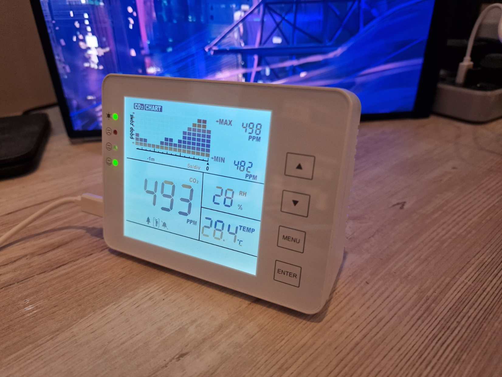
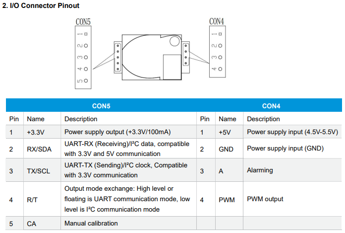
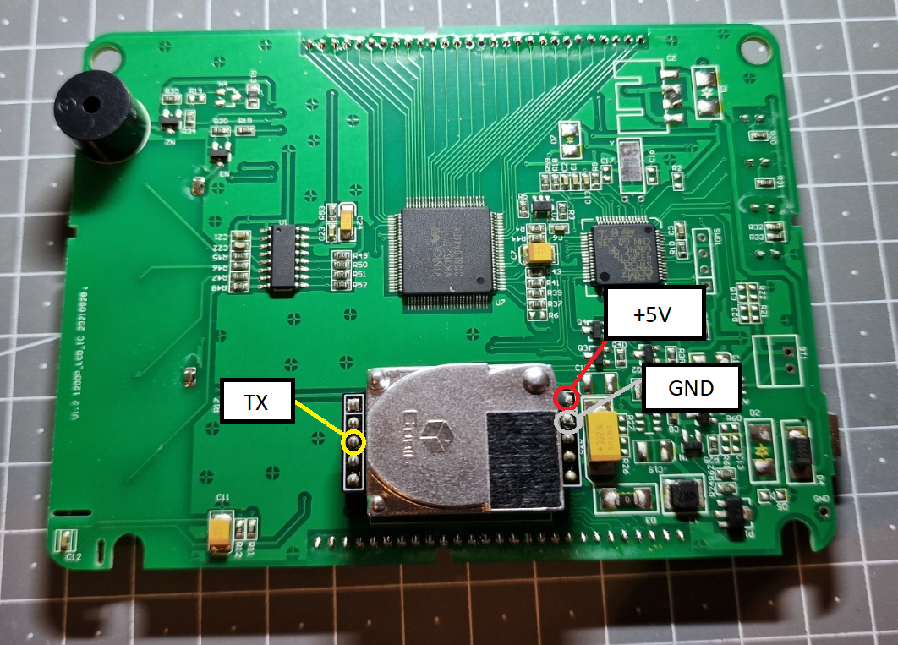
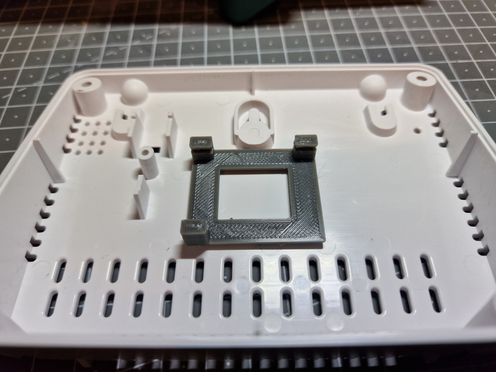
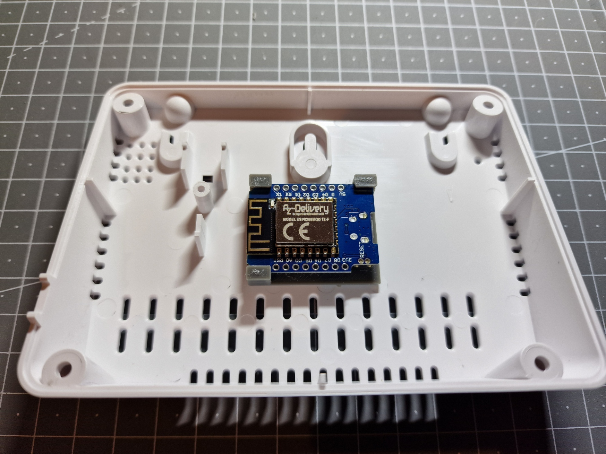
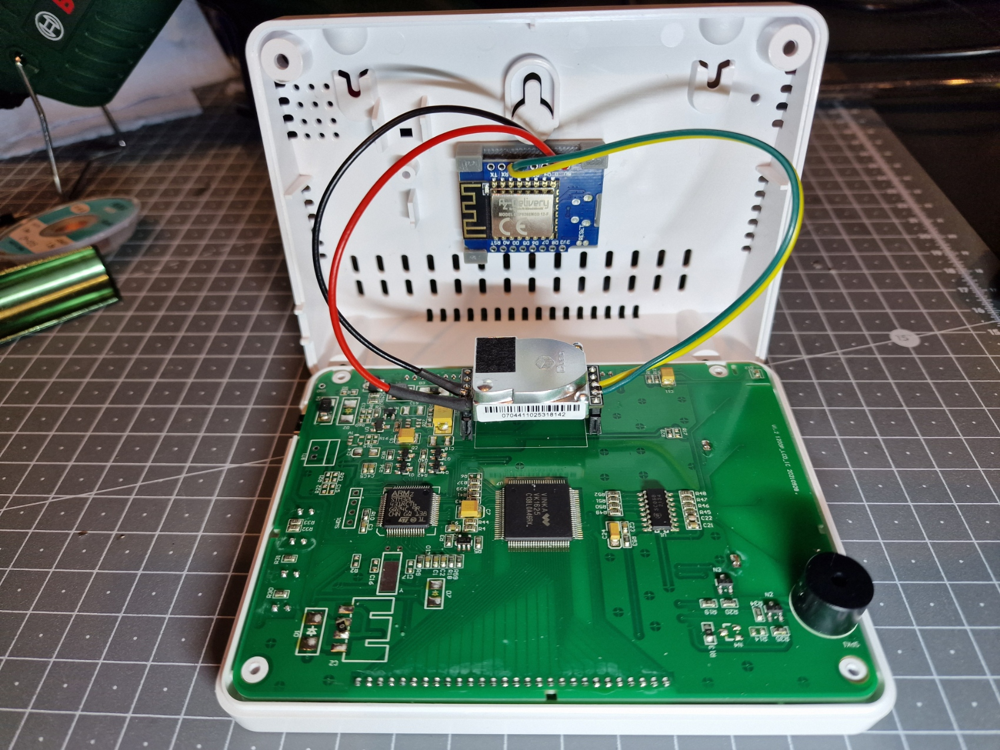

# Riiai SA1200P CO2 Monitor

This CO2 monitor was purchased from Amazon UK for £33.29 - it can also be found on AliExpress under various other brand names for wildly differing prices.

The CO2 sensor inside is a [Cubic CM1106-C](https://en.gassensor.com.cn/CO2Sensor/info_itemid_86.html) [ [Datasheet](https://en.gassensor.com.cn/Product_files/Specifications/CM1106-C%20Single%20Beam%20NDIR%20CO2%20Sensor%20Module%20Specification.pdf) ] which has similar dimensions to other CO2 sensors, and an identical pinout to the MTP40-F CO2 sensor but with a different data protocol.

For the purpose of this project, we're only interested in the +5V, GND and TX pins. The RX pin is shown connected to the D1 Mini in later photos, _this is not required_.

## Connecting the D1 Mini to the CO2 Sensor

The inside of the case is pretty spacious - there's enough room to mount the D1 mini directly to the case. STL and STEP files are included for the 3D printed mount - when printing, supports are required, and due to how narrow it is the channel that holds the circuit board will likely need cutting/dremelling out if you don't have the ability to print dissolvable supports. The mount can then be attached to the case with your adhesive of choice (hot glue etc).

Wiring the D1 mini to the CO2 sensor simply requires connecting 5V to 5V, GND to GND, and TX on the sensor to the GPIO pin of your choice which will be configured as UART RX in the ESPHome config. As mentioned above the sensor's RX line is connected in this photo but this is not necessary.

## ESPHome Firmware Installation

These instructions are for Home Assistant but are likely similar for other ESPHome platforms.

Copy the `esphome-web-sa1200p.yaml`, `secrets.yaml` (optional if you already have a secrets file) and `cubic_cm1106c_passive_sensor.h` files to the `esphome` directory in Home Assistant.

The SA1200P device polls the CO2 sensor for its PPM reading every 5 seconds, so this is the fastest update rate we can achieve since this is a passive setup where we rely on the existing hardware to drive the CO2 sensor. The firmware is configured to report an update to ESPHome every 60 seconds by default (i.e only using every 12th update), this can be configured by changing the `TARGET_UPDATE_SECS` value in `cubic_cm1106c_passive_sensor.h`.

The `esphome-web-sa1200p.yaml` file needs customising to specify your desired sensor name, as well as setting the UART RX/TX pins if you don't want to use pin D1 (GPIO5) as the UART RX.

Once flashed to the D1 mini, if everything is wired correctly you should start seeing CO2 readings logged by the D1 mini. The D1 mini will receive sensor values around 5 seconds before the display updates, as the device appears to internally buffer values for a period before displaying them.